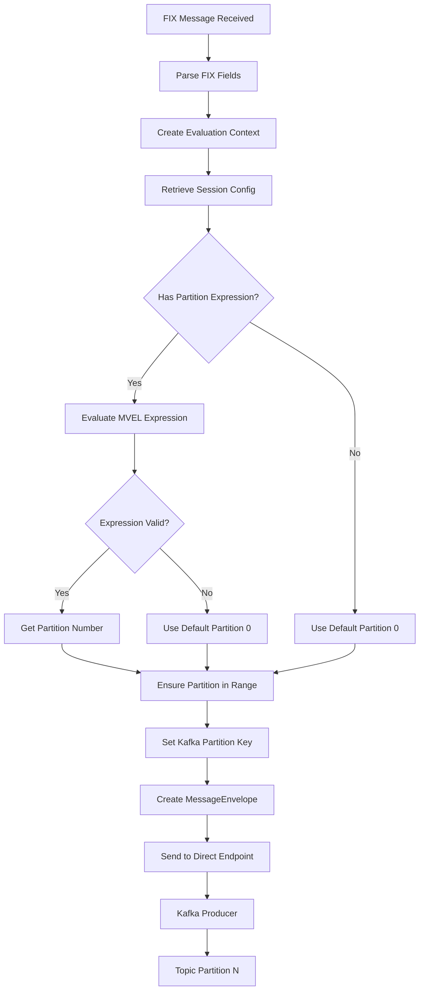

# Content-Based Routing Architecture Design

## Overview
Implement content-based routing to specific Kafka partitions based on MVEL expressions evaluated against FIX message content.

## Current Flow
```
FIX Message → FixApplication → MessageEnvelope → Direct Endpoint → Kafka Producer → Topic (1 partition)
```

## Proposed Flow with Content-Based Routing
```
FIX Message → FixApplication → Parse FIX fields → Evaluate MVEL Expression → Determine Partition → MessageEnvelope → Direct Endpoint → Kafka Producer with Partition Key → Topic (N partitions)
```

## Architecture Components

### 1. Configuration Updates
- **FixSessionConfig Model**: Add new properties:
  - `inputPartitions`: int (default: 1)
  - `partitionExpression`: String (MVEL expression)
- **fix-sessions.yaml**: Extend session configuration with new properties

### 2. MVEL Expression Evaluator Service
- **MvelExpressionService**: Service to evaluate MVEL expressions
- **Context Object**: Map containing FIX message fields (headers + body)
- **Result**: Integer partition number (0 to N-1)

### 3. FIX Message Parser
- Extract fields from raw FIX message for MVEL evaluation
- Support common FIX fields: MsgType, ClOrdID, Symbol, Side, Price, etc.
- Create a Map<String, Object> context for MVEL evaluation

### 4. Kafka Integration Updates
- **KafkaTopicInitializer**: Create topics with configurable partition count
- **FixKafkaRouteBuilder**: Configure producer to accept partition key
- **FixApplication**: Calculate partition key and set in message headers

### 5. Error Handling
- Default to partition 0 if expression evaluation fails
- Log warnings for invalid expressions
- Circuit breaker for MVEL evaluation failures

## MVEL Expression Examples

```java
// Example 1: Route based on MsgType and ClOrdID
if (MsgType == "D" && ClOrdID == "1" && Symbol == "MSFT") { 
    return 1; 
} else { 
    return 2; 
}

// Example 2: Hash-based routing for load distribution
return Math.abs(Symbol.hashCode()) % inputPartitions;

// Example 3: Simple type-based routing
switch(MsgType) {
    case "D": return 0;
    case "8": return 1;
    default: return 2;
}
```

## Data Flow Diagram



## Configuration Example

```yaml
fix:
  sessions:
    - sessionId: "FIX.4.4:GTWY->BANZ"
      type: "ACCEPTOR"
      senderCompId: "GTWY"
      targetCompId: "BANZ"
      # ... existing properties ...
      inputPartitions: 3
      partitionExpression: |
        if (MsgType == "D" && ClOrdID == "1" && Symbol == "MSFT") {
          1
        } else {
          2
        }
```

## Implementation Considerations

### 1. Performance
- Cache compiled MVEL expressions per session
- Pre-parse common FIX fields
- Consider async evaluation for high-throughput scenarios

### 2. Backward Compatibility
- Default `inputPartitions: 1` maintains current behavior
- Default `partitionExpression: null` routes to partition 0
- Existing configurations continue to work unchanged

### 3. Validation
- Validate partition expression syntax at startup
- Ensure partition number is within valid range (0 to N-1)
- Handle null/missing fields gracefully

### 4. Monitoring
- Add metrics for partition distribution
- Log partition routing decisions at DEBUG level
- Track MVEL evaluation errors

## Dependencies
- Add MVEL2 dependency to pom.xml
- Consider adding FIX field parsing utility if not already available

## Testing Strategy
1. Unit tests for MVEL expression evaluation
2. Integration tests with sample FIX messages
3. Performance tests for high-volume routing
4. Backward compatibility tests